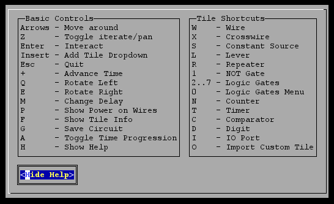
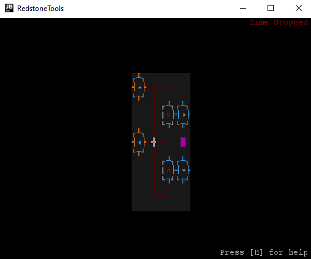

# RedstoneTools

# Index
- [Changelog](#changelog)
- [Description](#description)
- [Install Instructions](#install-instructions)
- [RedstoneTools Controls](#redstonetools-controls)
- [Extensive Report](#extensive-report)
- [Gameplay](#gameplay)
- [Screenshots](#screenshots)

# Changelog
[Go to Changelog](./CHANGELOG.md)

# Description
The project aimed to create an emulation of Minecraft's vanilla [redstone circuits](https://minecraft.fandom.com/wiki/Redstone_Circuits) with additional mechanics from prolific Minecraft Mods, such as [ProjectRed](https://github.com/MrTJP/ProjectRed), [RFTools](https://github.com/McJtyMods/RFTools), [Minecraft Circuit Mod](https://github.com/bubble-07/MinecraftCircuitsMod) and [Super Circuit Maker](https://github.com/amadornes/SuperCircuitMaker), providing an interface to manipulate and simulate circuits.

Developed by [Telmo Baptista](https://github.com/Telmooo) and [Tiago Silva](https://github.com/tiagodusilva).

# Install Instructions
To install the game it is just needed to download the source code, and compile it and run it using [Gradle](https://gradle.org/) or similar. Make sure you have Java installed and configured. Before running, ensure your system has the [Consolas](https://docs.microsoft.com/en-us/typography/font-list/consolas) font.

# RedstoneTools Controls

Navigate the menus using the arrow keys and Enter. After you open a circuit, a help menu becomes accessible by pressing `H`.

# Extensive Report
[Go to Report](./docs/README.md)

# Gameplay

# Screenshots
Lanterna Start Menu  

### Existing Tiles
  

From left to right, top to bottom:  
1. *Wire* and demonstration of all possible connections the wire can have.  
1. *Constant Source*, *Lever* (not active), *Lever* (active), *Repeater*, *NOT >Gate*, *AND Gate*, *OR Gate*, *NAND Gate*, *NOR Gate*, *XOR Gate*, *XNOR Gate*.
1. *Comparator* (comparison), *Comparator* (subtraction) , *Digit* (receiving power), *Digit* (not receiving), *Counter*, *Timer* (pulse mode), *Timer* (switch mode), *IO Tile* (incative facing up), *IO Tile* (outputting to the right), *IO Tile* (inputting from down), *Custom Tile* (one possible).
1. Demonstration of decaying power on the wire, changing the intensity of its colour and current selected tile shown with magenta background.

### Example Circuit (Half Adder)

