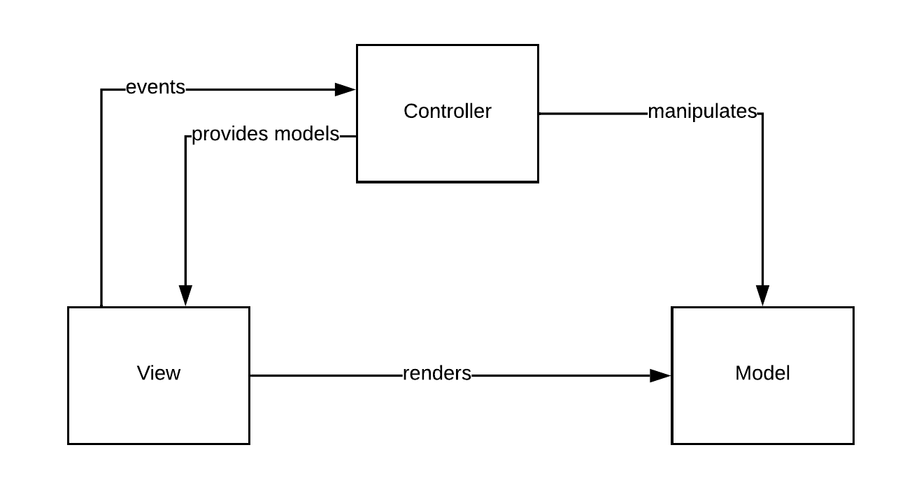
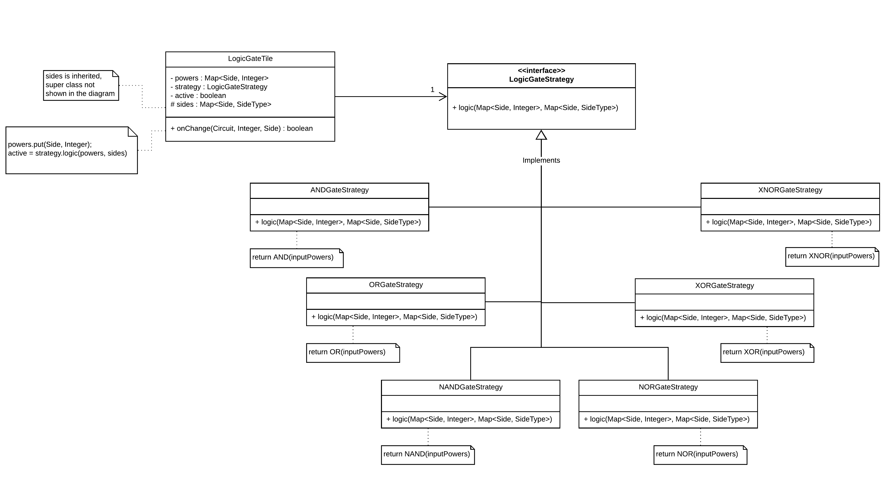

# LPOO_79
The project aimed .... **TODO**

It was developed by [Telmo Baptista](https://github.com/Telmooo) and [Tiago Silva](https://github.com/tiagodusilva) (***T Squad***).

## Table of Contents
1. [Implemented Features](#Implemented-Features)
    1. [Power](#power)
    2. [Tiles](#tiles)
        1. [Generic Tiles](#generic-tiles)
        2. [Specific Tiles](#specific-tiles)
    3. [Circuit](#circuit)
    4. [Menu](#menu)
    5. [Screenshots](#screenshots)
        1. [LanternaMenu](#lanterna-menu)
        2. [Temporary Pre-existing Circuit](temporary-pre-existing-circuit)

2. [Planned Features](#planned-features)
3. [Design & Patterns](#design)
    1. [Model View Controller](#model-view-controller-(mvc))
    2. [Changing the View](#changing-the-view)
    3. [TODO](#circuit-has-multiple-types-of-tiles)
    4. [TODO](#logic-gates-behave-similarly-only-changing-functionality)
4. [Known Code Smells and Refactoring Suggestions](#known-code-smells-and-refactoring-suggestions)
5. [Testing](#testing)
6. [Self-evaluation](#self-evaluation)

## Implemented Features
The features already implemented are listed below.

### Power
Our version of the world's electricity, it is the signal propagated on the circuit to emulate real world's [digital electronics](https://en.wikipedia.org/wiki/Digital_electronics), it was inspired by Minecraft's [redstone circuits](https://minecraft.fandom.com/wiki/Redstone_Circuits).

As such, this power system has two modes:
- *Redstone Mode* - The power decays from wire to wire, until it reaches the minimum power level, power level varies between 0 and 15 (*0x0-0xF*).
- *Electric Mode* - The power doesn't decay, it simulates lossless transport, taking two possible values, *ON* or *OFF*.

### Tiles
A tile is the basic component of a circuit, having its own behaviour and functionalities.
#### Generic Tiles
- [Tile](../src/main/java/com/lpoo/redstonetools/model/tile/OrientedTile.java) - The most generic tile, stating the behaviours and functionalities every tile should have.
- [OrientedTile](../src/main/java/com/lpoo/redstonetools/model/tile/OrientedTile.java) - An upgraded version of the generic tile *Tile*, capable of having configurable input and output sides, making possible to a tile receive power from only one specific side and not every side, etc.

#### Specific Tiles
- [NullTile](../src/main/java/com/lpoo/redstonetools/model/tile/NullTile.java) - A filler tile, has no behaviour or functionality, it serves as the default tile of a circuit.
- [ConstantSourceTile](../code/src/main/java/com/lpoo/redstonetools/model/tile/ConstantSourceTile.java) - A tile that provides a constant source of power.
- [WireTile](../src/main/java/com/lpoo/redstonetools/model/tile/WireTile.java) - Main power transporting tile.
- [LeverTile](../src/main/java/com/lpoo/redstonetools/model/tile/LeverTile.java) - An alternating power source tile, the lever functions the same as the constant source but can be toggled on whether outputs power or not.
- [RepeaterTile](../src/main/java/com/lpoo/redstonetools/model/tile/RepeaterTile.java) - An extensor of power, it transform any power received into a maximum strength power signal, as long as the input power signal is higher than the minimum power.  
    This tile is an *OrientedTile* that receives power from one side, and outputs on the opposite side.
- [LogicGateTile](../src/main/java/com/lpoo/redstonetools/model/tile/LogicGateTile.java) - It is an *OrientedTile* that receives power from two opposing sides and outputs from one of the other remaining sides.  
    As a logic gate, its behaviour is dependent on the logic gate it is currently simulating, the possible behaviours are:
    - *AND* Gate - Outputs power if it receives power higher than the minimum power level from both input sides.
    - *OR* Gate - Outputs power if it receives power higher than the minimum power level in any of the input sides.
    - *NAND* Gate - Negates the *AND* gate, behaving on the opposite way of the later.
    - *NOR* Gate - Negates the *OR* gate, behaving on the opposite way of the later.
    - *XOR* Gate - Outputs power if it receives power higher than the minimum power lever in only one of the input sides.
    - *XNOR* Gate - Negates the *XOR* gate, behaving on the opposite way of the later.
- [NotGateTile](../src/main/java/com/lpoo/redstonetools/model/tile/NotGateTile.java) - It is an *OrientedTile* that receives power from one side and outputs on the opposite side, similar to the *RepeaterTile*.  
    It behaves as power inverter, outputs power level if it receives it doesn't receive an higher power level than the minimum from the input, and doesn't output if it receives any power higher than the minimum power level from the input.

### Circuit
The powerhouse of the ~~cell~~ project.  
A circuit is a composition of tiles and handles all the interactions between tiles, insertion and deletion of tiles and the passage of time (*tick*).

### Menu
The welcoming screen.  
It is via the menu that you can create a new circuit or ~~load existing circuits~~ (loading not implemeneted yet, there is a temporary dynamically created circuit if this option is chosen).

### Screenshots
#### Lanterna Menu

#### Existing Tiles
  
From left to right, top to bottom:  
1. *Wire* and demonstration of all possible connections the wire can have.  
2. *Constant Source*, *Lever* (not active), *Lever* (active), *Repeater*, *NOT Gate*, *AND Gate*, *OR Gate*, *NAND Gate*, *NOR Gate*, *XOR Gate*, *XNOR Gate*.
3. Demonstration of decaying power on the wire, changing the intensity of its colour and current selected tile shown with magenta background.

#### Temporary Pre-existing Circuit
(*Note*: Temporary, as the name indicates, just for test purposes and to ease the visualization while file loading isn't implemented)

## Planned Features
- [x] Create circuits
- [ ] Load circuits
- [ ] Save circuits
- [x] CRUD methods on tiles
- [x] Support default combinational logic gates:
 - [x] AND gate
 - [x] OR gate
 - [x] NOT gate
 - [x] NAND gate
 - [x] NOR gate
 - [x] XOR gate
 - [X] XNOR gate
- [ ] Support default sequential gates:
 - [x] Repeater (signal extender)
 - [ ] Comparator (compares strength of two signals)
 - [ ] Counter (emits signal every N pulses received)
 - [ ] Timer (emits signal every N ticks)
- [ ] Support custom gates (reduce circuit into a tile)
- [ ] Support two types of circuit simulation:
 - [x] Variable strength signals (0-15), loosing strength at each wire travelled
 - [ ] Lossless two state signals

## Design

### Model-View-Controller (MVC)
#### Problem in Context
On the early stages of the project, we were trying to design the structure for the *MVC*, but we ended with what we could call the *(MC)V* as the model and the controller were on the same part. This generated a lot of trouble structuring the renderers and then joining it to the model-controller, creating a lot of unnecessary dependencies as the view could trigger changes on the model-controller, and the later would trigger changes on itself to update the model part. This is a clear violation the **Single Responsibility Principle** (SRP).

#### The Pattern
We have applied the same pattern, the architectural pattern *MVC*, but now in a decent way, where the model, view and controller are well isolated and each have its own purpose, dividing it into three parts:  
- The model holds the data about the object and some functionalities and behaviours the object are responsible of.  
- The view has the function of rendering the models and receiving events from user.  
- The controller provides the model to the view in order to be rendered, handles events sent by the view and manipulates the model according to those events.

#### The Implementation
As the implementation of this pattern involves multiple classes, and it's more an abstract idea it will not be provided specific classes, just the packages where each part is contained. The design implemented is show in the following figure:  

The three parts of the *MVC* can be found in:
- [Model](../src/main/java/com/lpoo/redstonetools/model/)
- [View](../src/main/java/com/lpoo/redstonetools/view/)
- [Controller](../src/main/java/com/lpoo/redstonetools/controller/)

#### Consequences
By applying this pattern in a more decent way, it was easier to structure the rest of the functionalities, resulting in a more elegant structure and well defined responsibilities for each part.

TODO: ???

### STATE STUFF
#### Problem in Context
    

#### The Pattern

STate

#### The Implementation

#### Consequences

### Changing the View
#### Problem in Context
Given our decision to separate a View into parts, one for each State, we needed a better way to distribute them. This need was highlighted even more whenever we wanted to transition from state A to state B, as we needed to also instanteate the particular view B from the "unrelated" state A.

#### The Pattern

For this problem we used both the Factory Pattern and the Abstract Factory Pattern. This approach allows for an easy switch between using different Views (by only changing the factory itself) and helps us respect both the SRP and the OCP because the abstract ViewFactory can simply ignore all the dependencies it actually needs (these dependencies are only present in the concrete ViewFactories). 

#### The Implementation

The Abstract Factory Pattern allows the Main Controller to simply instantiate the desired View, allowing any State to simply call `ViewFactory.getDesiredView()` and the Concrete Factory, for example LanternaViewFactory, to return the complete View object, which simplifies all our state transitions.

These classes can be found in the following files:
- [Abstract View Factory](../src/main/java/com/lpoo/redstonetools/view/ViewFactory.java)
- [Lanterna View Factory](../src/main/java/com/lpoo/redstonetools/view/lanterna/LanternaViewFactory.java)
- [Lanterna Circuit View](../src/main/java/com/lpoo/redstonetools/view/lanterna/LanternaCircuitView.java)
- [Lanterna Menu View](../src/main/java/com/lpoo/redstonetools/view/lanterna/LanternaMenuView.java)
- [View](../src/main/java/com/lpoo/redstonetools/view/View.java)
- [Circuit View](../src/main/java/com/lpoo/redstonetools/view/CircuitView.java)
- [Menu View](../src/main/java/com/lpoo/redstonetools/view/MenuView.java)
- [State](../src/main/java/com/lpoo/redstonetools/controller/state/State.java)
- [Circuit State](../src/main/java/com/lpoo/redstonetools/controller/state/CircuitState.java)
- [Menu State](../src/main/java/com/lpoo/redstonetools/controller/state/MenuState.java)
- [Main Controller](../src/main/java/com/lpoo/redstonetools/MainController.java)

#### Consequences

Abstract Factory garantees that the rest of the program does not need any more knowledge/dependencies on the View currently being used, as well as giving us more flexibility and allowing shared resources in a given View, such as a Terminal in Lanterna's case or some initialized buffers in an eventual OpenGL View. As far as alternatives go, we didn't have any, as this pattern was a perfect fit.

### Logic Gates Behave Similarly Only Changing Functionality
#### Problem in Context
All logic gates share the same behaviour and structure, with the [NotGateTile](#tiles) as the sole exception as it can produce unstable circuit states and has different structure (only one input). One could do a `switch` too select which functionality is currently being used by the logic gate, but this would violate the **Open-Closed Principle** (OCP), as the [LogicGateTile](#LogicGateTile) would need to be changed every time we decided to add a new possible functionality. Another option would be to create a class for each functionality a logic gate can have, creating one class for the *AND* Gate, one for the *OR* Gate, etc, but that would still violate the **Release Reuse Equivalency Principle** (REP), as all the behaviours are the same, and if we had to change the behaviour of the logic gate, it would need to be copied into all the possible classes that were created to accommodate the logic gates different functionalities.

#### The Pattern
This problem can be easily solved by using the **Strategy** pattern, as all the logic gates share behaviour and structure, only changing the functionality, we can implement that functionality as a strategy, and to change the logic gate functionality we just need to change the strategy inserted into it.

#### The Implementation
To implement this pattern, we just need to create a interface for the strategy, in this context the strategy is the functionality of the logic gate, this is, the operation done by the logic gate given the values of the powers received.  
The implementation of this pattern is illustrated in the following figure, simplifying the class *LogicGateTile* as this class extends from other *Tile* class as it is not relevant for this implementation:  

These classes can be found in the following files:
- [LogicGateTile](../src/main/java/com/lpoo/redstonetools/model/tile/LogicGateTile.java)
- [LogicGateStrategy](../src/main/java/com/lpoo/redstonetools/model/tile/strategy/LogicGateStrategy.java)
- [ANDGateStrategy](../src/main/java/com/lpoo/redstonetools/model/tile/strategy/ANDGateStrategy.java)
- [ORGateStrategy](../src/main/java/com/lpoo/redstonetools/model/tile/strategy/ORGateStrategy.java)
- [NANDGateStrategy](../src/main/java/com/lpoo/redstonetools/model/tile/strategy/NANDGateStrategy.java)
- [NORGateStrategy](../src/main/java/com/lpoo/redstonetools/model/tile/strategy/NORGateStrategy.java)
- [XORGateStrategy](../src/main/java/com/lpoo/redstonetools/model/tile/strategy/XORGateStrategy.java)
- [XNORGateStrategy](../src/main/java/com/lpoo/redstonetools/model/tile/strategy/XNORGateStrategy.java)

#### Consequences
This pattern allows more flexibility with the logic gate, making it easier to switch the functionality of a logic gate, as it doesn't require the removal and re-addition of the tile just to change the functionality. It also prevented a big `switch` statement that could be used to determine the functionality of the logic gate, so that's one code smell less.  
As the strategy is given to the tile, this pattern also allows now to make Dependency Injections that ease the process of testing this tile.  
This pattern required one additional interface, and six new classes, but these classes are extremely simple and small, making it easier to maintain compared to the other possibilities described in the problem.

## Known Code Smells and Refactoring Suggestions

## Testing

## Self-evaluation
This project was developed with maximum synergy, using [communication tools](https://discordapp.com/) to plan every feature while constantly reviewing each other code by live programming every time it was possible as well as an extra review of code by using [Github](https://github.com/)'s pull request system. Thus, it can be said each one did 100% of the work!
