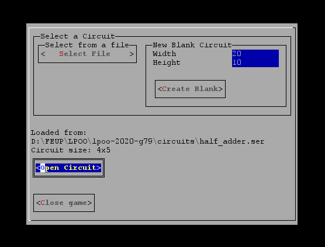
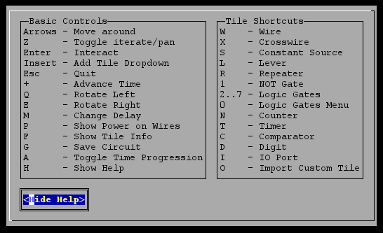
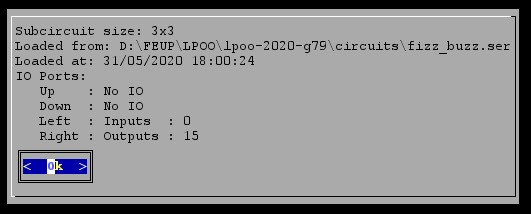
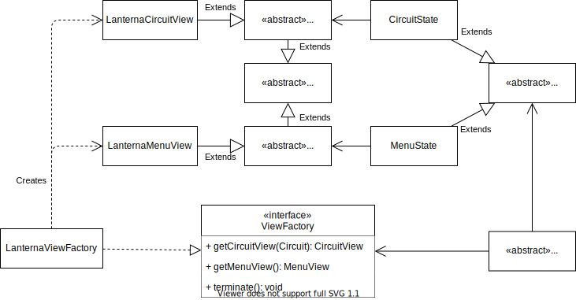
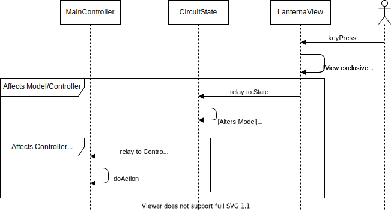
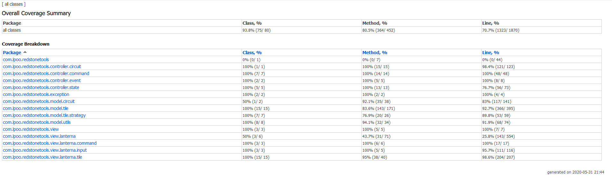
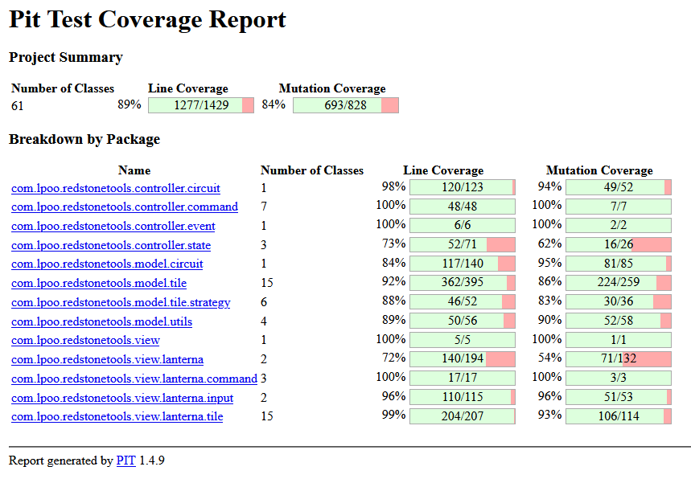

# **LPOO_79 - RedstoneTools**
The project aimed to create an emulation of Minecraft's vanilla [redstone circuits](https://minecraft.fandom.com/wiki/Redstone_Circuits) with additional mechanics from prolific Minecraft Mods, such as [ProjectRed](https://github.com/MrTJP/ProjectRed), [RFTools](https://github.com/McJtyMods/RFTools), [Minecraft Circuit Mod](https://github.com/bubble-07/MinecraftCircuitsMod) and [Super Circuit Maker](https://github.com/amadornes/SuperCircuitMaker), providing an interface to manipulate and simulate circuits.

Developed by [Telmo Baptista](https://github.com/Telmooo) and [Tiago Silva](https://github.com/tiagodusilva).

# Table of Contents
1. [Implemented Features](#Implemented-Features)
    1. [Power](#power)
    1. [Tiles](#tiles)
        1. [Generic Tiles](#generic-tiles)
        1. [Specific Tiles](#specific-tiles)
    1. [Circuit](#circuit)
    1. [Menu](#menu)
    1. [Config File](#config-file)
    1. [Screenshots](#screenshots)
        1. [LanternaMenu](#lanterna-menu)
        1. [Temporary Pre-existing Circuit](temporary-pre-existing-circuit)
1. [Planned Features](#planned-features)
1. [Design](#design)
    1. [Used Patterns](#used-patterns)
    1. [Model View Controller](#model-view-controller-(mvc))
    1. [Game States](#game-states)
    1. [Changing the View](#changing-the-view)
    1. [Logic Gates' Similar Behaviour](#logic-gates-similar-behaviour)
    1. [Event System](#event-system)
    1. [Commands](#commands)
    1. [So many Renderers](#so-many-renderers)
    1. [Circuit Updates](#circuit-updates)
    1. [Dealing with Empty Spaces](#dealing-with-empty-spaces)
    1. [Custom Circuits or Subcircuits](#custom-circuits-or-subcircuits)
1. [Known Code Smells and Refactoring Suggestions](#known-code-smells-and-refactoring-suggestions)
1. [Testing](#testing)
    1. [Steps of Testing](#steps-of-testing)
    1. [Property Testing](#property-testing)
    1. [Coverage](#coverage)
    1. [Mutation Test](#mutation-testing)
1. [Self-evaluation](#self-evaluation)

# Implemented Features
The features already implemented are listed below.

## Power
Our version of the world's electricity, it is the signal propagated on the circuit to emulate real world's [digital electronics](https://en.wikipedia.org/wiki/Digital_electronics). Tt was inspired by Minecraft's [redstone circuits](https://minecraft.fandom.com/wiki/Redstone_Circuits).

As such, the power level decays from wire to wire, until it reaches the minimum power level, power levels vary between 0 and 15 (*0x0-0xF*).

## Tiles
A tile is the basic component of a circuit, having its own behaviour and functionalities.
### Generic Tiles
- [Tile](../src/main/java/com/lpoo/redstonetools/model/tile/OrientedTile.java)  
The most generic tile, stating the behaviours and functionalities every tile should have.
- [OrientedTile](../src/main/java/com/lpoo/redstonetools/model/tile/OrientedTile.java)  
An upgraded version of the generic tile *Tile*, capable of having configurable input and output sides, making possible to a tile receive power from only one specific side and not every side, etc.

### Specific Tiles
- [NullTile](../src/main/java/com/lpoo/redstonetools/model/tile/NullTile.java)  
A filler tile, has no behaviour or functionality, it serves as the default tile of a circuit.
- [ConstantSourceTile](../code/src/main/java/com/lpoo/redstonetools/model/tile/ConstantSourceTile.java)  
A tile that provides a constant source of power.
- [WireTile](../src/main/java/com/lpoo/redstonetools/model/tile/WireTile.java)  
Main power transporting tile.
- [LeverTile](../src/main/java/com/lpoo/redstonetools/model/tile/LeverTile.java)  
An alternating power source tile, the lever functions the same as the constant source but can be toggled on whether outputs power or not.
- [RepeaterTile](../src/main/java/com/lpoo/redstonetools/model/tile/RepeaterTile.java)  
An extensor of power, it transform any power received into a maximum strength power signal, as long as the input power signal is higher than the minimum power.  
    This tile is an *OrientedTile* that receives power from one side, and outputs on the opposite side.
- [LogicGateTile](../src/main/java/com/lpoo/redstonetools/model/tile/LogicGateTile.java)  
It is an *OrientedTile* that receives power from two opposing sides and outputs from one of the other remaining sides.  
    As a logic gate, its behaviour is dependent on the logic gate it is currently simulating, the possible behaviours are:
    - *AND* Gate - Outputs power if it receives power higher than the minimum power level from both input sides.
    - *OR* Gate - Outputs power if it receives power higher than the minimum power level in any of the input sides.
    - *NAND* Gate - Negates the *AND* gate, behaving on the opposite way of the later.
    - *NOR* Gate - Negates the *OR* gate, behaving on the opposite way of the later.
    - *XOR* Gate - Outputs power if it receives power higher than the minimum power lever in only one of the input sides.
    - *XNOR* Gate - Negates the *XOR* gate, behaving on the opposite way of the later.
- [NotGateTile](../src/main/java/com/lpoo/redstonetools/model/tile/NotGateTile.java)  
It is an *OrientedTile* that receives power from one side and outputs on the opposite side, similar to the *RepeaterTile*.  
    It behaves as power inverter, outputs power level if it receives it doesn't receive an higher power level than the minimum from the input, and doesn't output if it receives any power higher than the minimum power level from the input.
- [Comparator](../src/main/java/com/lpoo/redstonetools/model/tile/ComparatorTile.java)  
It is an *OrientedTile* that receives power from three sides and outputs from another. It has two modes of operation:
  - **Comparison:**  
  > Compares its rear input to its two side inputs. If either side input is greater than the rear input, the comparator output turns off. If neither side input is greater than the rear input, the comparator outputs the same signal strength as its rear input.  
  >     -- [Minecraft Wiki](https://minecraft.gamepedia.com/Redstone_Comparator#Compare_signal_strength) 
  - **Subtraction:**  
  >  Subtracts the signal strength of the higher side input from the signal strength of the rear input.  
  >     -- [Minecraft Wiki](https://minecraft.gamepedia.com/Redstone_Comparator#Subtract_signal_strength)

- [Counter](../src/main/java/com/lpoo/redstonetools/model/tile/CounterTile.java)  
It is an *OrientedTile* that receives power from one side and outputs on the opposite side.  
Every *delay* pulses received on the input, it outputs a maximum signal. So for a delay of 5, every 4 pulses it will emit power. 
The only exception being delay 1, which will always output forever once it has received at least one pulse. 
- [Timer](../src/main/java/com/lpoo/redstonetools/model/tile/TimerTile.java)  
It is an *OrientedTile* that receives power from one side and outputs on the opposite side. It has two modes, **pulse** and **switch**, described below.  
Every *delay* ticks, it outputs a pulse (pulse mode) or toggles its output (switch mode). So for a delay of 5, every 4 it will "trigger". 
The only exception being delay 1, which will always output forever once a tick has passed.
The input side of the timer resets its behaviour, and keeps it stopped while the signal is active. 
- [Digit](../src/main/java/com/lpoo/redstonetools/model/tile/DigitTile.java)  
The digit's only purpose is to display the power level received on a given Tile, from all sides, and can be used as a visual output.
- [IO Tile](../src/main/java/com/lpoo/redstonetools/model/tile/IOTile.java)  
They allow for power to be transmitted to and from its circuit and an outside one. They are the core Tile for creating Subcircuits.  
These tiles can be in either Input mode (blue), Output mode (orange) or none, but can only target one side each. As such, you can only have one active IOTile per side, one pointing to each right, left, up and down directions.
- [Subcircuits](../src/main/java/com/lpoo/redstonetools/model/circuit/Circuit.java)  
This Tile allows for virtually anything we could program under our current system, as users can save their on circuits and reuse them as a single Tile in a different circuit.

## Circuit
The powerhouse of the ~~cell~~ project.  
A circuit is a composition of tiles and handles all the interactions between tiles, insertion and deletion of tiles and the passage of time (*tick*).

## Menu
The welcoming screen.  
It is via the menu that you can create a new circuit or load existing circuits.

## Config File
This project has a config file that allows the user to specify the target framerate and to toggle "dynamic FPS". The latter tries to stick to the framerate schedule as best as possible, for example if the last game loop took 4ms and we want a frame every 16ms, the program would halt for only 12ms instead of the full 16ms. This option runs better on higher end hardware.

## Screenshots

### Lanterna Menu
The starting menu, with a circuit being loaded from a file.

### Existing Tiles
  

From left to right, top to bottom:  
1. *Wire* and demonstration of all possible connections the wire can have.  
1. *Constant Source*, *Lever* (not active), *Lever* (active), *Repeater*, *NOT Gate*, *AND Gate*, *OR Gate*, *NAND Gate*, *NOR Gate*, *XOR Gate*, *XNOR Gate*.
1. *Comparator* (comparison), *Comparator* (subtraction) , *Digit* (receiving power), *Digit* (not receiving), *Counter*, *Timer* (pulse mode), *Timer* (switch mode), *IO Tile* (incative facing up), *IO Tile* (outputting to the right), *IO Tile* (inputting from down), *Custom Tile* (one possible).
1. Demonstration of decaying power on the wire, changing the intensity of its colour and current selected tile shown with magenta background.

### Example Circuit (Half Adder)

### Controls
Navigate the menus using the arrow keys and Enter. After you open a circuit, a help menu becomes accessible by pressing `H`.

### Info Menu
Every Tile has a string of information relating to its internal state, here's the most complex one, from a subcircuit.

# Planned Features
- [x] Create circuits
- [x] Load circuits
- [x] Save circuits
- [x] CRUD methods on tiles
- [x] Support default combinational logic gates:
  - [x] AND gate
  - [x] OR gate
  - [x] NOT gate
  - [x] NAND gate
  - [x] NOR gate
  - [x] XOR gate
  - [X] XNOR gate
- [x] Support default sequential gates:
  - [x] Repeater (signal extender)
  - [x] Comparator (compares strength of two signals)
  - [x] Counter (emits signal every N pulses received)
  - [x] Timer (emits signal every N ticks)
- [x] Support custom gates (reduce circuit into a tile)
- [x] Detect and handle unstable circuits
- [x] Variable strength signal (0-15), losing strength every wire travelled
- [x] Auto advancing time

# Design

 ## Used Patterns

- [Design Patterns](https://refactoring.guru/design-patterns)
    - [Creational Patterns](https://refactoring.guru/design-patterns/creational-patterns)
        - [Abstract Factory](https://refactoring.guru/design-patterns/abstract-factory)
        - [Factory Method](https://refactoring.guru/design-patterns/factory-method)
    - [Structural Patterns](https://refactoring.guru/design-patterns/structural-patterns)
        - [Bridge](https://refactoring.guru/design-patterns/bridge)
        - [Flyweight](https://refactoring.guru/design-patterns/flyweight)
        - [Composite](https://refactoring.guru/design-patterns/composite)
    - [Behavioral Patterns](https://refactoring.guru/design-patterns/behavioral-patterns)
        - [Chain of Responsibility](https://refactoring.guru/design-patterns/chain-of-responsibility)
        - [Command](https://refactoring.guru/design-patterns/command)
        - [Mediator](https://refactoring.guru/design-patterns/mediator)
        - [Observer](https://refactoring.guru/design-patterns/observer)
        - [State](https://refactoring.guru/design-patterns/state)
        - [Template Method](https://refactoring.guru/design-patterns/template-method)
        - [Null Object](https://sourcemaking.com/design_patterns/null_object)
- [Architectural Patterns](https://web.fe.up.pt/~arestivo/presentation/patterns/#architectural-patterns)
    - [Model-View-Controller (MVC)](https://web.fe.up.pt/~arestivo/presentation/patterns/#58)

## Model-View-Controller (MVC)
### Problem in Context
On the early stages of the project, we were trying to design the structure for the *MVC*, but we ended with what we could call the *(MC)V* as the model and the controller were on the same part. This generated a lot of trouble structuring the renderers and then joining it to the model-controller, creating a lot of unnecessary dependencies as the view could trigger changes on the model-controller, and the later would trigger changes on itself to update the model part. This is a clear violation the **Single Responsibility Principle** (SRP).

### The Pattern
We have applied the same pattern, the architectural pattern *MVC*, but now in a decent way, where the model, view and controller are well isolated and each have its own purpose, dividing it into three parts:  
- The model holds the data about the object and some functionalities and behaviours the object are responsible of.  
- The view has the function of rendering the models and receiving events from user.  
- The controller provides the model to the view in order to be rendered, handles events sent by the view and manipulates the model according to those events.

Due to our specific take on the MVC architecture, it also implies a **Bridge Pattern** must be present, as it has to support any type of View given, this will be mentioned with more context in [Changing the View](#changing-the-view).

### The Implementation
As the implementation of this pattern involves multiple classes, and it's more an abstract idea it will not be provided specific classes, just the packages where each part is contained. The design implemented is show in the following figure:  

The three parts of the *MVC* can be found in:
- [Model](../src/main/java/com/lpoo/redstonetools/model/)
- [View](../src/main/java/com/lpoo/redstonetools/view/)
- [Controller](../src/main/java/com/lpoo/redstonetools/controller/)

### Consequences
By applying this pattern in a more decent way, it was easier to structure the rest of the functionalities, resulting in a more elegant structure and well defined responsibilities for each part.

## Game States
### Problem in Context
We had the need to switch between Views, such as going from the starting MenuView to the CircuitView. This led us to a small finite state-machine, to handle all the logic of that particular View's circumstances.

### The Pattern
We obviously used the **State Pattern** here. It's a good fit because it's meant to be used literally for emulating finite state-machines.

### The Implementation
We also used this State pattern to delegate new responsabilities away from the MainController, such as knowing when the program has to stop or calling `cleanup()` on the used View when exiting a State.
The MainController has a State, initialized with the MenuState class. This allows the controller to only call the methods associated with any View:
 - processEvents() -> Called to delegate the responsability of interacting between the View and the Model
 - render() -> Called to update the screen, it's only wrapper to the actual call to View, so **Single Responsability Principle** (SRP) is not violated
 - atExit() -> Called whenever exiting this State to enter a new one
 - exit() -> Called to know if the program has to exit

This pattern can be found in the following files:
- [State](../src/main/java/com/lpoo/redstonetools/controller/state/State.java)
- [CircuitState](../src/main/java/com/lpoo/redstonetools/controller/state/CircuitState.java)
- [MenuState](../src/main/java/com/lpoo/redstonetools/controller/state/MenuState.java)
- [MainController](../src/main/java/com/lpoo/redstonetools/MainController.java)

### Consequences
It adds modularity, as every state has its own behaviour and rules, allowing seamless transitions between states of the program, with transitions being handled by themselves.

## Changing the View
### Problem in Context
Given our decision to separate a View into parts, one for each State, we needed a better way to distribute them. This need was highlighted even more whenever we wanted to transition from state A to state B, as we needed to also instanteate the particular view B from the "unrelated" state A.

### The Pattern
For this problem we used both the **Factory Pattern** and the **Abstract Factory Pattern**. This approach allows for an easy switch between using different Views (by only changing the factory itself) and helps us respect both the **Single Responsability Pattern** (SRP) and the **Open/Close Principle** (OCP) because the abstract ViewFactory can simply ignore all the dependencies it actually needs (these dependencies are only present in the concrete ViewFactories).

For this problem we used both the Factory Pattern and the Abstract Factory Pattern. This approach allows for an easy switch between using different Views (by only changing the factory itself) and helps us respect both the SRP and the OCP because the abstract ViewFactory can simply ignore all the dependencies it actually needs (these dependencies are only present in the concrete ViewFactories).

As we also used this to easily link any View to the Model/State, we can also consider it a **Bridge Pattern**. This pattern focuses on linking two different parts of an application in order to make the code more maintainable, as well as working correctly when replacing one of the parts with another.

### The Implementation
The Abstract Factory Pattern allows the Main Controller to simply instantiate the desired View, allowing any State to simply call `ViewFactory.getDesiredView()` and the Concrete Factory, for example LanternaViewFactory, to return the complete View object, which simplifies all our state transitions.

These patterns can be found in the following files:
- [Abstract ViewFactory](../src/main/java/com/lpoo/redstonetools/view/ViewFactory.java)
- [LanternaViewFactory](../src/main/java/com/lpoo/redstonetools/view/lanterna/LanternaViewFactory.java)
- [LanternaCircuitView](../src/main/java/com/lpoo/redstonetools/view/lanterna/LanternaCircuitView.java)
- [LanternaMenuView](../src/main/java/com/lpoo/redstonetools/view/lanterna/LanternaMenuView.java)
- [View](../src/main/java/com/lpoo/redstonetools/view/View.java)
- [CircuitView](../src/main/java/com/lpoo/redstonetools/view/CircuitView.java)
- [MenuView](../src/main/java/com/lpoo/redstonetools/view/MenuView.java)
- [State](../src/main/java/com/lpoo/redstonetools/controller/state/State.java)
- [CircuitState](../src/main/java/com/lpoo/redstonetools/controller/state/CircuitState.java)
- [MenuState](../src/main/java/com/lpoo/redstonetools/controller/state/MenuState.java)
- [MainController](../src/main/java/com/lpoo/redstonetools/MainController.java)

### Consequences

Abstract Factory garantees that the rest of the program does not need any more knowledge/dependencies on the View currently being used, as well as giving us more flexibility and allowing shared resources in a given View, such as a Terminal in Lanterna's case or some initialized buffers in an eventual OpenGL View. As far as alternatives go, we didn't have any, as this pattern was a perfect fit.

## Logic Gates' Similar Behaviour
### Problem in Context
All logic gates share the same behaviour and structure, with the [NotGateTile](#tiles) as the sole exception as it can produce unstable circuit states and has different structure (only one input). One could do a `switch` too select which functionality is currently being used by the logic gate, but this would violate the **Open-Closed Principle** (OCP), as the [LogicGateTile](#LogicGateTile) would need to be changed every time we decided to add a new possible functionality. Another option would be to create a class for each functionality a logic gate can have, creating one class for the *AND* Gate, one for the *OR* Gate, etc, but that would still violate the **Release Reuse Equivalency Principle** (REP), as all the behaviours are the same, and if we had to change the behaviour of the logic gate, it would need to be copied into all the possible classes that were created to accommodate the logic gates different functionalities.

### The Pattern
This problem can be easily solved by using the **Strategy Pattern**, as all the logic gates share behaviour and structure, only changing the functionality, we can implement that functionality as a strategy, and to change the logic gate functionality we just need to change the strategy inserted into it.

### The Implementation
To implement this pattern, we just need to create a interface for the strategy, in this context the strategy is the functionality of the logic gate, this is, the operation done by the logic gate given the values of the powers received.  
The implementation of this pattern is illustrated in the following figure, simplifying the class *LogicGateTile* as this class extends from other *Tile* class as it is not relevant for this implementation:  

This pattern can be found in the following files:
- [LogicGateTile](../src/main/java/com/lpoo/redstonetools/model/tile/LogicGateTile.java)
- [LogicGateStrategy](../src/main/java/com/lpoo/redstonetools/model/tile/strategy/LogicGateStrategy.java)
- [ANDGateStrategy](../src/main/java/com/lpoo/redstonetools/model/tile/strategy/ANDGateStrategy.java)
- [ORGateStrategy](../src/main/java/com/lpoo/redstonetools/model/tile/strategy/ORGateStrategy.java)
- [NANDGateStrategy](../src/main/java/com/lpoo/redstonetools/model/tile/strategy/NANDGateStrategy.java)
- [NORGateStrategy](../src/main/java/com/lpoo/redstonetools/model/tile/strategy/NORGateStrategy.java)
- [XORGateStrategy](../src/main/java/com/lpoo/redstonetools/model/tile/strategy/XORGateStrategy.java)
- [XNORGateStrategy](../src/main/java/com/lpoo/redstonetools/model/tile/strategy/XNORGateStrategy.java)

### Consequences
This pattern allows more flexibility with the logic gate, making it easier to switch the functionality of a logic gate, as it doesn't require the removal and re-addition of the tile just to change the functionality. It also prevented a big `switch` statement that could be used to determine the functionality of the logic gate, so that's one code smell less.  
As the strategy is given to the tile, this pattern also allows now to make Dependency Injections that ease the process of testing this tile.  
This pattern required one additional interface, and six new classes, but these classes are extremely simple and small, making it easier to maintain compared to the other possibilities described in the problem.

## Event System
### Problem in Context
We didn't want the View to directly interface and change the Model. There are also some things that are exclusive to a given View, such as moving the Circuit's view window in the LanternaCircuitView. If we had two threads created by the View attempting to alter the same Model, it could result in some concorrency problems it really shouldn't have to worry about. This also comes as an imposition from implementing an MVC architectural pattern.

### The Pattern
To tackle both of these aspects, we implemented a **Chain of Responsability Pattern**, as it demands exectly what we needed, that a class should handle what it is able to on its own, and relay forward anything it cannot do.

This came to fruition as our Event System (explained below in Implementation), which automatically brought about the **Mediator Pattern**. It also helps maintain the MVC. This pattern states that there should be a class handling "requests" from other classes trying to interact between themselves. It can also easily devolve into an anti-pattern if not handled correctly, as it could evolve into a [God Object](https://en.wikipedia.org/wiki/God_object).

### The Implementation
Using LanternCircuitView mentioned above as an example, whenever the user presses the arrow keys, the view window is moved. The class automatically handles this, as it is exclusive to itself and doesn't require any outside knowledge. Whenever the user presses the hotkey to add a Tile however, LanternaCircuitView would need knowledge on the CircuitController, so it delegates this to the State using the following method:

Every View has a Queue of Events, consisting of an Enum indicating what action needs to be taken (InputEvent) and an Object used to pass additional information on some actions. The need for this will be made more apparent on the following [Commands](#commands) chapter. Every game loop, the GameController calls `State.processEvents()`, in which the State (the mediator) processes every Event in the Queue and handles it (currently the chain of command goes no further, as even the QUIT event is also handled inside the State superclass).

These patterns can be found in the following files:
- [State](../src/main/java/com/lpoo/redstonetools/controller/state/State.java")
- [CircuitState](../src/main/java/com/lpoo/redstonetools/controller/state/CircuitState.java")
- [MenuState](../src/main/java/com/lpoo/redstonetools/controller/state/MenuState.java")
- [Event](../src/main/java/com/lpoo/redstonetools/controller/event/Event.java)
- [InputEvent](../src/main/java/com/lpoo/redstonetools/controller/event/InputEvent.java)
- [View](../src/main/java/com/lpoo/redstonetools/view/View.java)
- [LanternaCircuitView](../src/main/java/com/lpoo/redstonetools/view/lanterna/LanternaCircuitView.java)
- [LanternaMenuView](../src/main/java/com/lpoo/redstonetools/view/lanterna/LanternaMenuView.java)

### Consequences
Preventing the View from directly altering the Model, separating responsabilities exclusive to the View from the rest of the Model and Controller.

## Commands
### Problem in Context
We needed a way to execute small actions without violating the **Single Responsability Principle** (SRP) and that was easy to maintain. Such actions include adding a Tile to the Circuit, rotating or interacting with a Tile, among others.

### The Pattern
We implemented the **Command Pattern**, which can encapsulate a request as an object, thereby letting us parameterize different requests or operations.

### The Implementation
We created a base Command interface with only a `void execute()` as a requirement.

This pattern can be found in the following files:
- Command Interface:
  - [Command](../src/main/java/com/lpoo/redstonetools/controller/command/Command.java)
- General Commands:
  - [AddTileCommand](../src/main/java/com/lpoo/redstonetools/controller/command/AddTileCommand.java)
  - [AdvanceTickCommand](../src/main/java/com/lpoo/redstonetools/controller/command/AdvanceTickCommand.java)
  - [EnterStateCommand](../src/main/java/com/lpoo/redstonetools/controller/command/EnterStateCommand.java)
  - [InteractionCommand](../src/main/java/com/lpoo/redstonetools/controller/command/InteractionCommand.java)
  - [RotateLeftCommand](../src/main/java/com/lpoo/redstonetools/controller/command/RotateLeftCommand.java)
  - [RotateRightCommand](../src/main/java/com/lpoo/redstonetools/controller/command/RotateRightCommand.java)
  - [SetDelayCommand](../src/main/java/com/lpoo/redstonetools/controller/command/SetDelayCommand.java)
- View Exclusive Commands:
  - [LanternaToggleShowPowerCommand](../src/main/java/com/lpoo/redstonetools/view/lanterna/command/LanternaToggleShowPowerCommand.java)
  - [MoveSelectionCommand](../src/main/java/com/lpoo/redstonetools/view/lanterna/command/MoveSelectionCommand.java)
  - [MoveViewWindowCommand](../src/main/java/com/lpoo/redstonetools/view/lanterna/command/MoveViewWindowCommand.java)
- Used in and by, for example
  - [State](../src/main/java/com/lpoo/redstonetools/controller/state/State.java")
  - [CircuitState](../src/main/java/com/lpoo/redstonetools/controller/state/CircuitState.java")
  - [MenuState](../src/main/java/com/lpoo/redstonetools/controller/state/MenuState.java")
  - [Event](../src/main/java/com/lpoo/redstonetools/controller/event/Event.java)
  - [InputEvent](../src/main/java/com/lpoo/redstonetools/controller/event/InputEvent.java)
  - [View](../src/main/java/com/lpoo/redstonetools/view/View.java)
  - [LanternaCircuitView](../src/main/java/com/lpoo/redstonetools/view/lanterna/LanternaCircuitView.java)
  - [LanternaMenuView](../src/main/java/com/lpoo/redstonetools/view/lanterna/LanternaMenuView.java)

### Consequences
The Commands we developed ended up being very versatile, as we used them for both View exclusive actions as well as MVC spanning ones, making the code much more readable and maintanable. It also helped establish both the **Single Responsability Principle** and the **Open/Close Principle**.

## So many Renderers
### Problem in Context
When developing the Lanterna rendering for the circuit, we quicly came to realize that having a TileRenderer per Tile would be unnecessary and wasteful. Having one TileRenderer per Tile also meant we violated the **Single Responsability Principle** (SRP), so this issue had to be taken care of quickly.

### The Pattern
When developing the structure needed for the MVC, the **Flyweight Pattern** appeared as we developed the LanternaCircuitView class. This pattern solved our problems by garanteeing that only one instance of these Renderer classes was needed at a time, as they are always reused.

As a side-effect, our LanternaCircuitView also has a kind of *Hierarchical Model-View-Controller* (HMVC), as for every Tile subclass there is one LanternaTileRenderer.

### The Implementation
The LanternaCircuitView has one instance of every LanternaTileRenderer, mapped to every Tile. When rendering a circuit we simply call the correct Renderer.

This pattern can be found in the following file:
  - [LanternaCircuitView](../src/main/java/com/lpoo/redstonetools/view/lanterna/LanternaCircuitView.java)

### Consequences
Less resources taken from the system as well as a better separation of responsabilities. Unlike an usual downside of this pattern, our code ended up much simpler than before.

## Circuit Updates
### Problem in Context
Whenever a Tile updates its output, there are almost always changes to be made in the rest of the Circuit. For example, toggling a Lever with a Wire next to it means the Wire's power may change, so we need to try to update it.

### The Pattern
To solve this problem we used the **Observer Patterm**, which allows objects to be notified of something whenever it may happend.

The **Mediator Pattern** appeared naturally.

### The Implementation
In our case, whenever the CircuitController adds, removes, rotates or interacts with a Tile, it triggers an Update to it, as it may require to be changed. Furthermore, it also notifies their neighbours in the Circuit (up, down, left and right). Our updates also contain the Power received and the Side the update comes from. This intends to mimic a basic event-driven circuit simulation (as well as Minecraft's vanilla redstone mechanics).

As an improvement, our update method only really updates (Tile's method `onChange()`) if it would really changes. As an example, when a not gate receives an update from a non-input side, it doesn't care and ignores it. Whenever the updated Tile's output changes, then the update call returns true, signaling the circuit that its neighboring Tiles should be updated as well. In the case described above, it would return false.

These patterns can be found in the following files:
- [CircuitController](../src/main/java/com/lpoo/redstonetools/controller/circuit/CircuitController.java)
- [Circuit](../src/main/java/com/lpoo/redstonetools/model/circuit/Circuit.java)
- [Tile](../src/main/java/com/lpoo/redstonetools/model/tile/Tile.java)
- All the Tile's subclasses

### Consequences
Really hard to know exactly how many Tile updates an action may have. Removes the dependancy between a Tile and its neighbors, as the CircuitController serves as mediator between them (**Mediator Pattern**).

## Dealing with Empty Spaces

### Problem in Context
Our solution to simluating the circuits relies heavily on interaction between neighboring tiles, as such, we needed to make sure that these interactions would always work as expected, to avoid unintended behaviour or worse.

### The Pattern
The **Null Object Pattern** came naturally in this scenario, as it allows us to specify exactly the behaviour for whenever a Tile doesn't exist (or should be neutral).

### The Implementation
This pattern was implemented in the aptly named Null Tile, which always answers calls such as `acceptsPower()` or `outputsPower()` with *false* and to `getPower()` with `Power.getMin()`. This ensures the compatibility with the remaining systems is preserved. It also came in handy for broken tiles (tiles previously causing unstable circuits that got "fried"), as they behave exactly as a NullTile would. Therefore, a broken tile is just a NullTile with a different rendering.

These patterns can be found in the following files:
- [Tile](../src/main/java/com/lpoo/redstonetools/model/tile/Tile.java)
- [NullTile](../src/main/java/com/lpoo/redstonetools/model/tile/NullTile.java)
- [LanternaNullTileView](../src/main/java/com/lpoo/redstonetools/view/lanterna/tile/LanternaNullTileView.java)
- All the remaining Tile's subclasses

### Consequences
Allows the Circuit to not test for *null*s, adds support for tiles whose behaviour should be neutral and permits an exclusive TileView for them.

The circuit became larger (both in RAM and when saved to disk), as more objects needed to be created and stored. This is a bigger issue because we can't reuse the same NullTile, as they must save their own Position within the Circuit.

## Custom Circuits or Subcircuits

### Problem in Context
We wanted to implement a feature that a allowed a user more freedom and not limit the tiles available to them. As such we needed a method that allowed custom content to be created.

### The Pattern
The **Composite Pattern** was the obvious choice, given the tree structure of our problem: A circuit running another circuit that could be running even more...
The **Chain of Command Pattern** also came unintentionally, as every time we wanted to update/check on a subcircuit, we delegated said responsability to it.

### The Implementation
To allow for subcircuits we first created *IO Tiles*, whose purpuose is to connect power from inside a circuit to the outside (and vice-versa). To then create a subcircuit we made *Circuit* extend the abstract *Tile*, implementing and overriding all the required methods.

As a Circuit is made of numerous objects that extend Tile, it can also be made of multiple Circuits now. Due to the especially complex nature of this object, some changes in the CircuitController were necessary. All these changes revolved around notifying/updating neighbouring tiles.

When updating a circuit tile, we delegate the responsability of propagating to the subcircuit. If the subcircuit then needs to propagate some change to the outside, it delegates that responsability back to the initial circuit.

These patterns can be found in the following files:
- [Tile](../src/main/java/com/lpoo/redstonetools/model/tile/Tile.java)
- [IO Tile](../src/main/java/com/lpoo/redstonetools/model/tile/IOTile.java)
- [Circuit](../src/main/java/com/lpoo/redstonetools/model/circuit/circuit.java)
- [Circuit Controller](../src/main/java/com/lpoo/redstonetools/controller/circuit/CircuitController.java)

### Consequences
More complex CircuitController but allowed this important feature to come to fruition. It allows complex tiles to be created both by a user (by using the interface) or the programmer (by simply extending Circuit).

# Known Code Smells and Refactoring Suggestions

## Unnecessary Rendering Iterations
In the method `renderCircuit` of [LanternaMenuView](../src/main/java/com/lpoo/redstonetools/view/lanterna/LanternaCircuitView.java), the function executes multiple unnecessary iterations, causing it to render parts that aren't from the circuit. By improving the looping conditions it is possible to improve the performance of the rendering process.

This code smell has been refactored, with the advantages of removing the unnecessary renders at the cost of a more complex condition in terms of readability.

## Switch Statement
Some `switch` statements are used in the program to handle events in order to determine which event is occurring, however refactoring this code smell could bring an even greater number of code smells or add unwanted complexity and abstraction to the program.  
The statements are also simple and short, thus there's no big payoff on refactoring this code smell.

Classes with `switch` statements:
- [LanternaInput](../src/main/java/com/lpoo/redstonetools/view/lanterna/input/LanternaInput.java)
- [CircuitState](../src/main/java/com/lpoo/redstonetools/controller/state/CircuitState.java)
- [MenuState](../src/main/java/com/lpoo/redstonetools/controller/state/MenuState.java)

## Mega Menu builder
All the code related to instantiating the various Lanterna menus has been condensed into [LanternaMenuBuilder](../src/main/java/com/lpoo/redstonetools/view/lanterna/LanternaMenuBuilder.java). This allows us to use dependency injection to test the Lanterna Views, however, this class is ridden with *odd* code, due to Lanterna's menu system and its threaded nature.

The ammount of *Runnable*s, *Consumer*s, *Lambda*s and even anonymous classes required contribute to this factor even further. At the very least, these have agilized the provided menus to fit various different contextes and made them extremely generalized.

This code smell is too difficult to clean under the given deadline, and has already suffered a major refactor. This refactor was responsible for cleaning the Lanterna Views, introducing dependency injection to facilitate the testing of those classes and uniting all code relative to the menus.

## Inneficient Commands

All the commands used in our Event System and the various States have a strong disadvantage: every time we need to run one, we have to create an object that will never be used again. This also affects our ability to test their use in the States.

A better implementation would be in a style of Java's **Consumer**s, as they would only need to be instanteated once, and from thereon after simply use a method like **Consumer**'s `accept()`, which would allow us to feed it an argument and run the command at once. This would also have been a great use for the **Lazy Initialization** design pattern. 

# Testing
Thanks to our extensive implementation of the *Model-View-Controller* (MVC), the Unit Tests can cover all the Model, Controller and most of the View (excluded are [LanternaMenuBuilder](../src/main/java/com/lpoo/redstonetools/view/lanterna/LanternaMenuBuilder.java) as explained [previously](#mega-menu-builder) and [LanternaViewFactory](../src/main/java/com/lpoo/redstonetools/view/lanterna/LanternaViewFactory.java) as it is responsible for instantiating Lanterna's objects).

## Steps of Testing
While creating [Unit Testing](https://en.wikipedia.org/wiki/Unit_testing) guarantees more safety when applying changes, as it verifies if the components changed are still working as intended. However due to the nature of some controllers, such as the [CircuitController](../src/main/java/com/lpoo/redstonetools/controller/circuit/CircuitController.java), the tests lean on a more abstract behaviour (testing if the correct calls are being made and triggered the anticipated events but doesn't test if the update itself is correctly done).

The next step of Testing is [Integration Testing](https://en.wikipedia.org/wiki/Integration_testing) in order to test how two larger modules (e.g.: Model and Controller) interact between themselves, but still has a medium level of abstraction (e.g.: the Controller interacts with a partially mocked Model and vice-versa, to safely test only certain components at a time).

The final step of Testing is [System Testing](https://en.wikipedia.org/wiki/System_testing) in order to ensure that the desired behaviour is implemented and that there are no inconsistensies between the various units when integrated together (e.g.: test if an unstable loop is detected). This phase requires that all previous steps have been successful.

## Property Testing
Another approach to Testing is [Property Testing](https://en.wikipedia.org/wiki/Property_testing) in order to garantee that given an arbitrary input, the object under test must remain consistent.

The simplest and most comprehensive example is one of the property tests of the [LeverTile](../src/test/java/com/lpoo/redstonetools/model/tile/LeverTileTest.java), where we know that if the Lever is toggled an even ammount of times it must return to the same initial state, but if toggled an odd ammout it must return to the oppossite of the initial state.

## Coverage

The tests results can be checked below:

- [Coverage Result](./reports/coverage)  

## Mutation Testing

Unfortunately, due to pitest's lack of support for jqwik tests, there were some mutations that survived the other set of tests. Furthermore, as pitest does not support Junit5, a conversion had to be made as well.

Many of the surviving mutations were caused by a change in getters/setters whose tests are pointless (e.g.: getInfo() on tiles), unreachable code (e.g.: mutation in the `default` branch of a complete `switch` statement) or extraordinarily hard to test code (e.g.: threaded functions or Lanterna's menus).

- [Pitest Testing Result](./reports/pitest/model_mutation/)

# Self-evaluation
This project was developed with maximum synergy, using [communication tools](https://discordapp.com/) to plan every feature while constantly reviewing each other code by live programming every time it was possible as well as an extra review of code by using [Github](https://github.com/)'s pull request system. Thus, it can be said each one did 100% of the work!

As of Release v2.02, our total work count went up to 120 hours each.
